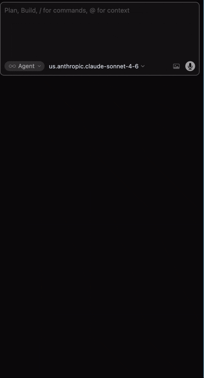

# backctl

A CLI and MCP server that gives developers and AI assistants fast, unified access to Backstage from your terminal or any MCP-compatible tool.

## Why does this exist?

Backstage is a powerful developer portal — but its value is locked inside a web UI. There is no first-class way to query your catalog, browse TechDocs, or traverse service dependencies from a terminal or an AI agent.

**backctl closes that gap.**

It exposes the full Backstage API surface as a CLI you can script, pipe, and automate and as an MCP server that any AI assistant (Cursor, Claude, OpenCode, etc.) can call directly during agentic workflows. No more copy-pasting URLs or tab-switching mid-task.

## Who is this for?

| Persona | How backctl helps |
|---------|-------------------|
| **Platform engineers** | Inspect, validate, and refresh catalog entries without touching the UI |
| **Backend / full-stack developers** | Discover APIs, owners, and dependencies of any service in seconds |
| **AI agents / coding assistants** | Query live catalog data, resolve entity refs, and retrieve TechDocs inline while generating or reviewing code |
| **DevOps / SRE** | Script catalog queries in CI pipelines and runbooks |

## What problem does it eliminate?

The developer portal holds authoritative information: service ownership, API contracts, dependency graphs, TechDocs, but none of it is reachable from the command line or from an AI assistant.

This creates friction at exactly the wrong moment: when a developer or an agent is already in a flow and needs one answer to continue. The typical workarounds (opening a browser, searching the UI, copy-pasting a JSON blob) break concentration and slow down iteration.

**backctl removes that interruption** by making the full Backstage catalog a first-class citizen in your terminal and in agentic workflows.

**Let your AI agent do it**: add the MCP server once and it can answer questions like *"who owns the x-events API?"* or *"what services consume my component?"* without leaving the chat.

## Installation

### Quick install (remote)

```sh
curl -sSfL https://raw.githubusercontent.com/jsolana/backctl/main/install.sh | bash
```

Install a specific version:

```sh
curl -sSfL https://raw.githubusercontent.com/jsolana/backctl/main/install.sh | bash -s -- -v v0.2.2
```

Install to a custom directory (no sudo required):

```sh
curl -sSfL https://raw.githubusercontent.com/jsolana/backctl/main/install.sh | bash -s -- -d ~/.local/bin
```

### Using go install

```sh
go install github.com/jsolana/backctl/cmd/backctl@latest
```

### From source

```sh
git clone https://github.com/jsolana/backctl.git
cd backctl
make build
./bin/backctl --help
```

### Install script options

```console
Usage: install.sh [OPTIONS]

Options:
  -v, --version TAG    Install a specific version/tag (default: latest)
  -p, --path DIR       Build from a local checkout instead of cloning
  -d, --dir DIR        Installation directory (default: /usr/local/bin)
  -h, --help           Show this help
```

## Quick Start

```sh
# Point backctl at your Backstage instance
export BACKSTAGE_URL=https://backstage.example.com

# List all components
backctl catalog list --kind component

# Get a specific entity
backctl catalog get component:default/my-service
```

## Entity Ref Format

Backstage identifies entities using the format `kind:[namespace/]name`. When namespace is omitted, it defaults to `default` (or the value of `BACKSTAGE_NAMESPACE` if set).

Examples:

- `component:my-service` resolves to `component:default/my-service`
- `component:platform/my-service` uses namespace `platform` explicitly
- `api:default/my-api`

## Configuration

### Config file

backctl loads settings from `~/.config/backctl/config.yaml` (or `$XDG_CONFIG_HOME/backctl/config.yaml`). You can override the path with `--config`.

Example `config.yaml`:

```yaml
base_url: https://backstage.example.com
token_file: ~/.config/backctl/token
namespace: default
output: json
timeout: 30s
no_auth: false
verbose: false
```

### Precedence

Values are resolved in this order (first wins):

1. Explicit CLI flag (`--base-url`, `--namespace`, etc.)
2. Environment variable (`BACKSTAGE_URL`, `BACKSTAGE_NAMESPACE`, `BACKSTAGE_TOKEN`)
3. Config file (`~/.config/backctl/config.yaml`)
4. Hardcoded default

### Environment variables and flags

| Variable / Flag | Config key | Description | Default |
|-----------------|------------|-------------|---------|
| `BACKSTAGE_URL` / `--base-url` | `base_url` | Base URL of the Backstage instance | (required) |
| `BACKSTAGE_TOKEN` | — | Bearer token for authentication | |
| — / `--token-file` | `token_file` | Path to a file containing the bearer token | |
| `BACKSTAGE_NAMESPACE` / `-n` | `namespace` | Default namespace for entity refs | `default` |
| — / `--timeout` | `timeout` | HTTP request timeout | `30s` |
| — / `-o` | `output` | Output format (table, json, yaml) | table |
| — / `--no-auth` | `no_auth` | Disable authentication entirely | `false` |
| — / `-v` | `verbose` | Verbose output to stderr | `false` |

## Commands

### catalog

Interact with the Backstage Software Catalog.

- `catalog list` - List entities with optional kind/filter (supports cursor pagination with `--after`)
- `catalog get <ref>` - Get a single entity by ref
- `catalog ancestry <ref>` - Show entity provenance chain (how it arrived in the catalog)
- `catalog validate -f <file>` - Validate an entity definition without registering it
- `catalog refresh <ref>` - Trigger immediate re-ingestion of an entity (write operation)
- `catalog facets` - List available facets and their values

### search

- `search <term>` - Search the Backstage catalog by term

### techdocs

Access TechDocs documentation.

- `techdocs get <ref> [path]` - Retrieve rendered documentation page
- `techdocs list-pages <ref>` - List available pages (table of contents)
- `techdocs metadata <ref>` - Get TechDocs metadata for an entity
- `techdocs entity <ref>` - Get the TechDocs entity descriptor

### relations

Explore entity relationships (enriched with owner, lifecycle, and tier metadata).

- `relations tree <ref>` - Display entity relationship tree
- `relations list <ref>` - List direct relations for an entity

### locations

Query catalog locations.

- `locations list` - List all registered locations
- `locations get <id>` - Get a location by ID

### completion

Generate shell completion scripts.

- `completion bash` - Bash completions
- `completion zsh` - Zsh completions
- `completion fish` - Fish completions
- `completion powershell` - PowerShell completions

Setup examples:

```sh
# Zsh (add to ~/.zshrc)
source <(backctl completion zsh)

# Bash
source <(backctl completion bash)

# Fish
backctl completion fish | source
```

### version

- `version` - Print version, commit, and build date

## MCP Integration

backctl includes `backctl-mcp`, a Model Context Protocol server that exposes the Backstage catalog to AI agents (Cursor, Claude Desktop, etc.). It supports two transports: **stdio** (default, for local IDE integration) and **HTTP** (for shared or remote deployments).

<div align="center">
  
</div>

### Building the Docker image

```sh
make docker-build
```

This produces a `backctl-mcp:latest` image (~15MB) containing both the MCP server and the `backctl` binary.

### MCP Configuration

The MCP server is configured entirely through environment variables:

| Variable | Required | Description |
|----------|----------|-------------|
| `BACKSTAGE_URL` | Yes | Base URL of the Backstage instance (e.g. `https://backstage.example.com`) |
| `BACKSTAGE_TOKEN` | No | Bearer token for Backstage API authentication |
| `BACKSTAGE_TIMEOUT` | No | HTTP request timeout (default: `30s`) |
| `MCP_TRANSPORT` | No | Transport to use: `stdio` (default) or `http` |
| `MCP_HTTP_ADDR` | No | Address to listen on in HTTP mode (default: `:8080`) |

### IDE configuration (Cursor) — stdio transport

Add the following to your MCP settings (`.cursor/mcp.json` or global settings):

```json
{
  "mcpServers": {
    "backctl-mcp": {
      "command": "docker",
      "args": [
        "run", "--rm", "-i",
        "-e", "BACKSTAGE_URL=https://backstage.example.com",
        "-e", "BACKSTAGE_TOKEN=your-token-here",
        "ghcr.io/jsolana/backctl-mcp:0.2.2"
      ]
    }
  }
}
```

Alternatively, forward the variables from your shell environment instead of hardcoding them:

```json
{
  "mcpServers": {
    "backctl-mcp": {
      "command": "docker",
      "args": [
        "run", "--rm", "-i",
        "-e", "BACKSTAGE_URL",
        "-e", "BACKSTAGE_TOKEN",
        "ghcr.io/jsolana/backctl-mcp:0.2.2"
      ]
    }
  }
}
```

Ensure `BACKSTAGE_URL` and `BACKSTAGE_TOKEN` are set in your shell before launching the IDE.

### IDE configuration (Cursor) — HTTP transport

When the server is already running (e.g. deployed centrally), connect to it via URL:

```json
{
  "mcpServers": {
    "backctl-mcp": {
      "url": "http://your-host:8080/mcp"
    }
  }
}
```

### Running the server in HTTP mode

Start the server with `MCP_TRANSPORT=http` and publish the port:

```sh
docker run --rm -p 8080:8080 \
  -e MCP_TRANSPORT=http \
  -e BACKSTAGE_URL=https://backstage.example.com \
  -e BACKSTAGE_TOKEN=your-token-here \
  ghcr.io/jsolana/backctl-mcp:0.2.2
```

The server exposes a single endpoint at `/mcp` that accepts `POST` (requests), `GET` (event stream), and `DELETE` (session termination) as per the [MCP Streamable HTTP spec (2025-03-26)](https://modelcontextprotocol.io/specification/2025-03-26/basic/transports#streamable-http).

### Available tools

| Tool | Description |
|------|-------------|
| `search` | Free-text search across catalog entities and TechDocs |
| `get_entity` | Get full entity details by ref (metadata, spec, relations) |
| `get_relationships` | Traverse the dependency graph from an entity |
| `get_techdocs_page` | Fetch rendered documentation page as plain text |
| `list_entities` | List/filter catalog entities by kind and spec fields |
| `list_techdocs_pages` | List available documentation pages (table of contents) |
| `execute` | Run any backctl subcommand (escape hatch for advanced queries) |

### Running without Docker

For local development, you can run the MCP server directly:

```sh
make build-mcp

# stdio (default)
BACKSTAGE_URL=https://backstage.example.com BACKSTAGE_TOKEN=xxx ./bin/backctl-mcp

# HTTP
BACKSTAGE_URL=https://backstage.example.com BACKSTAGE_TOKEN=xxx \
MCP_TRANSPORT=http ./bin/backctl-mcp
```

## Pending / Roadmap

The following areas are not yet covered:

**Write operationsd**:

- Entity creation (POST /entities)
- Entity deletion (DELETE /entities/by-uid)
- Location creation (POST /catalog/locations)
- Location deletion (DELETE /catalog/locations/:id)

**TechDocs**:

- Sync status endpoint

**Search**:

- (Nice to have) No semantic search (not available in Backstage OSS)

**APIs not yet implemented**:

- Scaffolder API (software templates listing, task creation, task logs)
- Permissions API (authorization decision queries)
- Kubernetes proxy API
- Events/webhooks API

**Client improvements**:

- Cache persistence to disk for cross-invocation reuse

**Agent integration** (https://backstage.io/docs/ai/skills):

- Create a Cursor Skill backed by the CLI to enable agents to resolve common workflows (e.g. "find the owner of a service", "discover APIs consumed by a component", "locate relevant TechDocs for onboarding")

## Contributing

See [CONTRIBUTING.md](CONTRIBUTING.md) for development setup, testing instructions, and release process.
